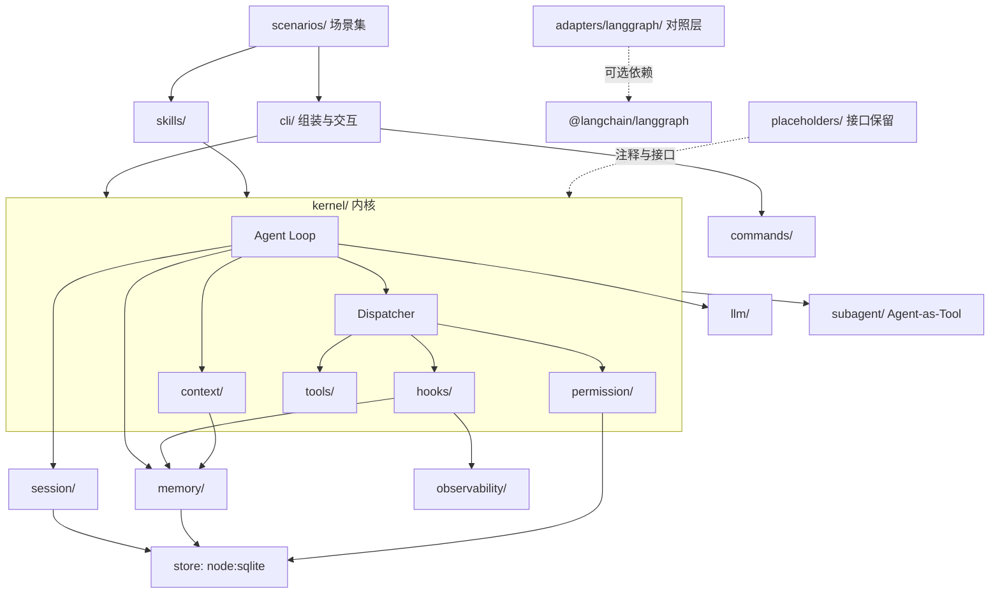

# 01 · 总体架构与数据流

> 本文是 harness-lab 的架构地图：设计哲学 → 十层模块对照 → 数据流 → 目录结构 → 关键接口。
> 阅读顺序建议：先读第 0 节「设计哲学」，再读第 3 节「一次 query 的完整数据流」，其余按需查阅。
> 关键取舍的原因见 `02-design-decisions.md`（ADR）；逐模块学习路线见 `03-module-guide.md`。

---

## 0. 设计哲学（三条铁律）

本项目的前提判断来自对 zero2Agent 教程的通读结论：**Agent 的主战场不在模型，在 Harness**。

1. **核心手写、框架对照**：Agent Loop / Tool Dispatch / Context / Permission / Session / Hook
   全部从零手写（这是学习对象本身）；LangGraph 只出现在 `src/adapters/langgraph/` 对照层，
   用来回答「同样的循环用框架表达是什么样、代价是什么」。
2. **确定性优先**：一切外部依赖（LLM / 时钟 / 随机数）都必须可替换。
   离线状态下用 FakeProvider 能跑通全部测试与演示——对齐 zero2Agent 的
   `agent-api-lab` 方法论（FakeProvider + 固定脚本 + 场景断言）。
3. **代码即教程**：每个模块的注释回答三个问题——
   「这一环在系统里扮演什么角色」「数据怎么流进来/流出去」「为什么这样设计、代价是什么」。
   冲突或暂不成立的模块**注释保留、结构不删**（见 ADR-010）。

---

## 1. 十层 Harness 与本项目模块对照

源自 zero2Agent `final-project`（OfferPilot）的十层心智模型，本项目按此组织：

| # | 层 | 本项目模块 | 优先级 | 职责一句话 |
|---|---|---|---|---|
| 1 | Query Engine | `src/llm/` | P0 | 模型接入：Provider 抽象、流式组装、重试、模型路由 |
| 2 | Tools | `src/tools/` | P0 | 工具注册、schema 校验、执行与错误规范 |
| 3 | Skills | `src/skills/` | P1 | 确定性编排（把 N 个工具按固定顺序串成能力包） |
| 4 | Context | `src/context/` | P0 | 分层预算、多级压缩、组装 prompt |
| 5 | Memory | `src/memory/` | P1 | 长期记忆：存储、检索、写入白名单 |
| 6 | Permission | `src/permission/` | P0 | 风险分级、规则匹配、确认交互、审计 |
| 7 | Session | `src/session/` | P0 | 会话状态机、持久化、检查点与恢复 |
| 8 | Command | `src/commands/` | P1 | 斜杠命令拦截（进 LLM 之前处理） |
| 9 | Hook | `src/hooks/` | P0 | 横切关注点管道（pre/post、5 种 outcome） |
| 10 | Sub-agent | `src/subagent/` | P1 | Agent-as-Tool、并发池、编排 |

内核把它们粘起来：

| 内核组件 | 文件 | 职责 |
|---|---|---|
| Agent Loop | `src/kernel/agent-loop.ts` | 驱动「组装上下文 → 调模型 → 执行工具 → 回填结果」的循环 |
| Dispatcher | `src/kernel/dispatcher.ts` | 单次工具调用的四步管道：pre-hook → permission → execute → post-hook |
| EventBus | `src/kernel/events.ts` | 全链路事件流（可观测性的底座，Tracer/Cost 都消费它） |

横切与配套：

| 组件 | 文件 | 职责 |
|---|---|---|
| Observability | `src/observability/` | 事件追踪、token/成本统计 |
| Eval | `src/eval/` | 评估闭环：场景即数据 + 行为断言 + 双 Rig（CI 退出码锚定） |
| CLI | `src/cli/` | 组装（App）、REPL、入口参数解析 |
| 预留模块 | `src/placeholders/` | MCP / Web-SSE / STT / Agent Teams 接口保留（见 ADR-010） |
| 对照层 | `src/adapters/langgraph/` | 用 LangGraph 重表达同一 Loop（学习对照） |
| 演示场景 | `scenarios/` | 完整场景集：内置基准 4 + 权限 / hook / 子代理 / 会话四域 8（`pnpm scenarios`） |

---

## 2. 分层依赖图

依赖只能自上而下，不允许反向依赖（违背时先改设计，不要绕过）：



要点：

- `kernel/` 不知道 `cli/` 的存在，也不知道具体场景——场景通过「组装」注入；
- `session/`、`memory/`、`permission/` 共享同一个 SQLite 存储层（`store ` 抽象）；
- `adapters/langgraph/` 是**叶子**，不被任何核心模块依赖（可整体删除而不影响内核）。

---

## 3. 一次 query 的完整数据流

从用户在 REPL 敲入一行文字开始，到回答落盘结束。括号内标注「代码所在模块」：

```text
用户输入 "帮我算一下 3 的平方 (1)
    │
    ▼
[commands] CommandParser 检查是否以 "/" 开头
    │   是 → 执行斜杠命令（/status /history ...），不进 LLM
    ▼ 否
[session] SessionManager 取/建会话，状态 created → processing
    │
    ▼
[kernel] AgentLoop.run(session, input)  ← 一个 while 循环
    │
    ├─(2) [context] ContextManager.build()
    │       按 5 层信息分层组装（system/profile/task/history/recent）
    │       预算不足 → 逐级压缩（compressor）
    │       memory 检索结果注入 task 层
    │
    ├─(3) [llm] Provider.stream(request)
    │       流式事件经 StreamAssembler 组装为一条完整 assistant 消息
    │       （text_delta 可即到即显；tool_calls 必须等完整 JSON）
    │
    ├─(4) 判断：有 tool_calls？
    │       无 → 终结：回答回写 session，Memory 触发检查，Loop 退出
    │       有 ↓
    │
    ├─(5) 对每个 tool_call：[kernel] Dispatcher.dispatch()
    │       ├─ pre-hooks（脱敏 10 / 权限预检 …）
    │       ├─ [permission] PermissionGate.check() → allow/confirm/deny
    │       │       confirm → CLI 交互确认（30s 超时默认拒绝）
    │       │       deny   → 生成拒绝 Result 返回给模型（不是崩溃！）
    │       ├─ [tools] Tool.execute() → ToolResult（永不抛异常）
    │       └─ post-hooks（审计 10 / 结果压缩 20 / 记忆触发 30 / 进度 40）
    │
    ├─(6) 工具结果写回 [context]（超限先压缩再写入）
    │
    └─(7) 预算/轮次检查 → 回到 (2) 或强制终结
    │
    ▼
[session] 持久化消息与检查点；[observability] 记录 token/成本；状态 → completed
    │
    ▼
返回给用户
```

图中数字 (1)-(7) 是本项目跑通「第一个端到端」的最小实现顺序（见 `03-module-guide.md`）。

---

## 4. 目录结构总览

```text
harness-lab/
├── README.md                    # 快速开始（仓库入口——四步跑通演示）
├── docs/                        # 文档（本文档集）
├── scripts/                     # 开发脚本（lab 九幕演示 / Node 原生 TS 冒烟）
├── src/
│   ├── index.ts                 # 库出口（public API 汇总）
│   ├── types.ts                 # 全局共享类型（消息/事件/ToolResult…）
│   ├── config.ts                # 配置中心（预算/重试/开关，显式默认值）
│   ├── errors.ts                # 错误分类（8 类，对齐教程的 error taxonomy）
│   ├── kernel/                  # 内核：Loop / Dispatcher / EventBus
│   ├── llm/                     # Provider 抽象 + Fake + OpenAI 兼容 + Anthropic
│   ├── tools/                   # Tool 协议 + Registry + 内置演示工具
│   ├── context/                 # 分层预算 + 多级压缩
│   ├── permission/              # 风险分级 + 规则 + 确认 + 审计
│   ├── session/                 # 状态机 + 持久化 + 检查点
│   ├── hooks/                   # 管道 + 内置 hooks
│   ├── memory/                  # 存储 + 检索 + 触发
│   ├── skills/                  # 确定性编排
│   ├── commands/                # 斜杠命令
│   ├── subagent/                # Agent-as-Tool + 并发池 + 编排
│   ├── observability/           # Tracer + Cost
│   ├── eval/                    # 评估闭环（场景 + 断言 + 双 Rig）
│   ├── adapters/langgraph/      # 对照层（可选依赖）
│   ├── placeholders/            # 预留模块（接口 + 注释，见 ADR-010）
│   └── cli/                     # 组装 / REPL / 入口
├── scenarios/                   # 完整场景集（12 场景四域——pnpm scenarios）
└── tests/                       # unit / integration / scenarios 三层
```

---

## 5. 关键接口草案

> 完整定义见 `src/types.ts`（实现时以此为准，本节的目的是先让读者建立「形状感」）。
> 命名对齐 zero2Agent `final-project` 的接口设计，便于两套材料互相印证。

### 5.1 消息与流式事件（规范化模型）

```ts
// 内部「规范形」消息：所有 Provider 适配到这一形状，能力差异收敛在适配层
type Message =
  | { role: 'system'; content: string }
  | { role: 'user'; content: string }
  | { role: 'assistant'; content: string; toolCalls?: ToolCall[] }
  | { role: 'tool'; content: string; toolCallId: string; name: string };

// 流式事件：Union 而不是 any —— 让「组装状态机」可以穷尽检查
type StreamEvent =
  | { type: 'text_delta'; text: string }
  | { type: 'thinking_delta'; text: string }        // 预留：推理模型
  | { type: 'tool_call_start'; id: string; name: string }
  | { type: 'tool_call_delta'; id: string; argsDelta: string }
  | { type: 'tool_call_end'; id: string }
  | { type: 'message_end'; stopReason: StopReason; usage: Usage };
```

### 5.2 Provider

```ts
interface LLMProvider {
  readonly name: string;
  complete(req: LLMRequest): Promise<LLMResponse>;
  stream(req: LLMRequest): AsyncIterable<StreamEvent>;
  countTokens(text: string): number;   // 预算是硬约束，计数必须可预估
}
```

### 5.3 Tool

```ts
interface Tool<TInput = unknown> {
  readonly name: string;
  readonly description: string;
  readonly inputSchema: z.ZodType<TInput>;   // schema 即文档，也是运行时校验
  readonly risk: RiskLevel;                  // low/medium/high/critical
  execute(input: TInput, ctx: ToolContext): Promise<ToolResult>;
}

type ToolResult =
  | { ok: true; content: string }
  | { ok: false; content: string; error: { code: ToolErrorCode; message: string } };
```

### 5.4 Hook（5 种 outcome 是管道的灵魂）

```ts
type HookOutcome =
  | { kind: 'continue' }
  | { kind: 'modify_input'; input: unknown }      // 改参数后继续
  | { kind: 'modify_result'; result: ToolResult } // 改结果后继续
  | { kind: 'block'; reason: string }             // 阻断（如权限拒绝）
  | { kind: 'skip' };                             // 跳过后续 hook（如已拦截）

interface Hook {
  readonly name: string;
  readonly priority: number;                      // 数字小者先执行
  readonly events: HookEventName[];
  handler(payload: HookPayload, ctx: HookContext): Promise<HookOutcome>;
}
```

---

## 6. 演进路线（为什么现在只做这些）

- **P0（跑通端到端所需的最小闭环）**：Query Engine → Tools → Dispatcher → Hook → Permission → Context → Session。
  顺序刻意与 `final-project` 的推荐开发顺序一致，每一步都能独立演示。
- **P1（工程完整度）**：Memory、Command、Skill、Sub-agent、Observability、Eval。
- **P2（接口保留、不实现）**：MCP、Web/SSE、多模态 STT、Agent Teams——
  这些需要额外基础设施或与当前「单进程 CLI」形态冲突，**以接口 + 注释保留结构**，
  避免「删掉后以后想加时找不到设计依据」（原则见 ADR-010）。

---

*下一篇：`02-design-decisions.md` —— 每个关键取舍的「为什么」。*
